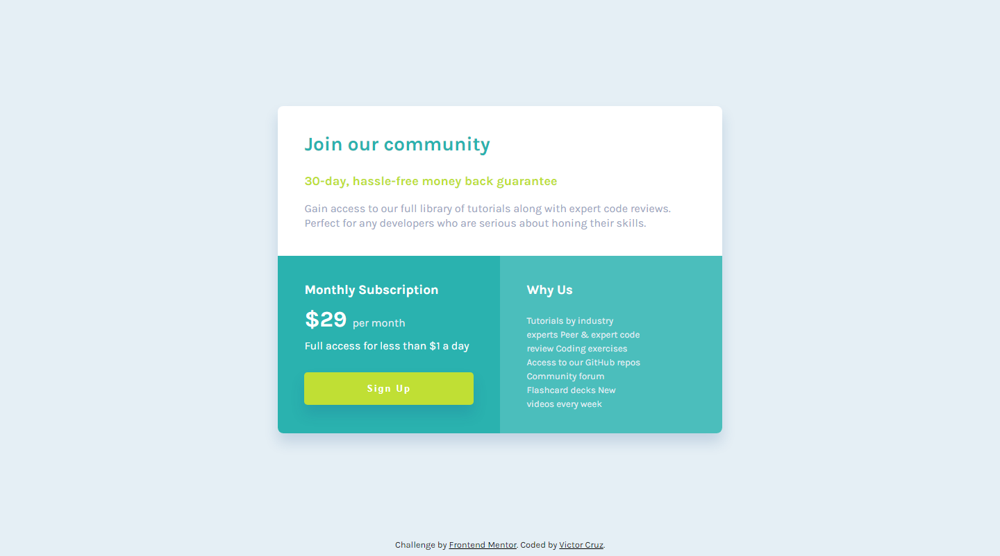

# Frontend Mentor - Single price grid component solution

This is a solution to the [Single price grid component challenge on Frontend Mentor](https://www.frontendmentor.io/challenges/single-price-grid-component-5ce41129d0ff452fec5abbbc). Frontend Mentor challenges help you improve your coding skills by building realistic projects. 

## Table of contents

- [Frontend Mentor - Single price grid component solution](#frontend-mentor---single-price-grid-component-solution)
  - [Table of contents](#table-of-contents)
  - [Overview](#overview)
    - [The challenge](#the-challenge)
    - [Screenshot](#screenshot)
    - [Links](#links)
  - [My process](#my-process)
    - [Built with](#built-with)
    - [What I learned](#what-i-learned)
  - [Author](#author)

## Overview

### The challenge

Users should be able to:

- View the optimal layout for the site depending on their device's screen size

### Screenshot

### Links
- Solution URL: [https://github.com/ikreuz](https://github.com/ikreuz/single-price-grid-challenge)
- Live Site URL: [https://vercel.com](https://single-price-grid-challenge-seven.vercel.app)

## My process

### Built with

- Semantic HTML5 markup
- CSS custom properties
- Flexbox
- CSS Grid
- Mobile-first workflow

### What I learned

I consider that I learned how to design a component, based on certain predefined requirements. I consider that these challenges are important, since instead of a component you can think of a web page that must be designed following this learning vector.

## Author

- Website - [Victor Cruz](https://github.com/ikreuz/)
- Frontend Mentor - [@ikreuz](https://www.frontendmentor.io/profile/ikreuz)
